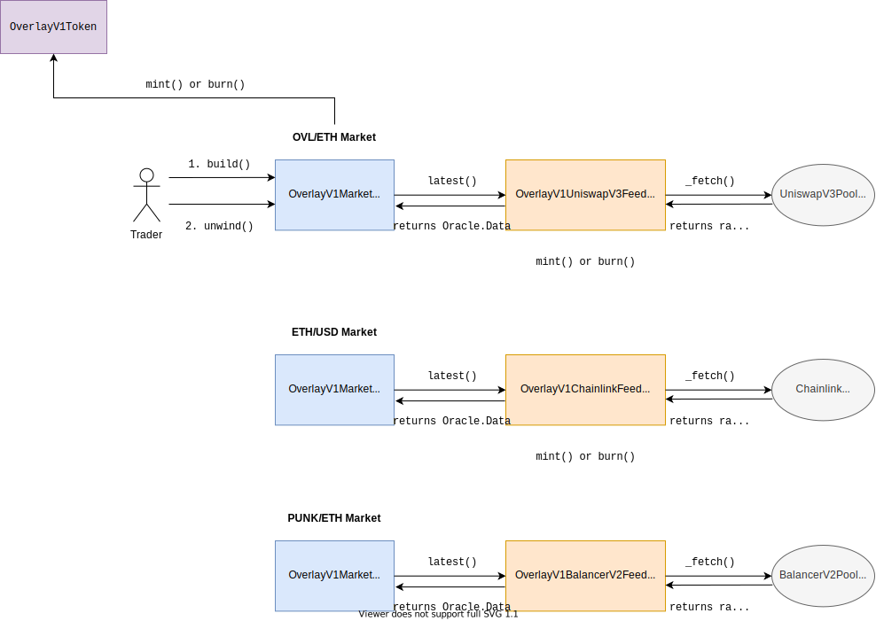

# v1-core

[](https://github.com/overlay-market/v1-core/actions/workflows/lint-python.yaml)
[](https://github.com/overlay-market/v1-core/actions/workflows/lint-solidity.yaml)
[](https://github.com/overlay-market/v1-core/actions/workflows/test-python.yaml)

V1 core smart contracts


## Requirements

To run the project you need:

- Python >= 3.9.2
- [Brownie >= 1.17.2](https://github.com/eth-brownie/brownie)
- Local Ganache environment installed
- `.env` file in project root with format

```
# required environment variables
export WEB3_INFURA_PROJECT_ID=<INFURA_TOKEN>
export ETHERSCAN_TOKEN=<ETHERSCAN_TOKEN>
```

To generate the required tokens, see

- `ETHERSCAN_TOKEN`: Creating an API key in [Etherscan's API docs](https://docs.etherscan.io/getting-started/viewing-api-usage-statistics)
- `WEB3_INFURA_PROJECT_ID`: Getting Started in [Infura's API docs](https://infura.io/docs)


## Diagram




## Modules

V1 core relies on three modules:

- [Markets Module](#markets-module)
- [Feeds Module](#feeds-module)
- [OVL Module](#ovl-module)


### Markets Module

Traders interact directly with the market contract to take positions on a data stream. Core functions are:

- `build()`
- `unwind()`
- `liquidate()`
- `update()`

Traders transfer OVL collateral to the market contract to back a position. This collateral is held in the market contract until the trader unwinds their position when exiting the trade. OVL is the only collateral supported for V1.

The market contract tracks the current open interest for all outstanding positions on a market as well as [information about each position](./contracts/libraries/Position.sol), that is needed in order to calculate the current value of the position in OVL terms:

```
library Position {
    /// @dev immutables: notionalInitial, debtInitial, midTick, entryTick, isLong
    /// @dev mutables: liquidated, oiShares, fractionRemaining
    struct Info {
        uint96 notionalInitial; // initial notional = collateral * leverage
        uint96 debtInitial; // initial debt = notional - collateral
        int24 midTick; // midPrice = 1.0001 ** midTick at build
        int24 entryTick; // entryPrice = 1.0001 ** entryTick at build
        bool isLong; // whether long or short
        bool liquidated; // whether has been liquidated (mutable)
        uint240 oiShares; // current shares of aggregate open interest on side (mutable)
        uint16 fractionRemaining; // fraction of initial position remaining (mutable)
    }
}
```

For each market contract, there is an associated feed contract that delivers the data from the data stream. The market contract stores a pointer to the `feed` contract that it retrieves new data from, and the market uses the feed's `update()` function to retrieve the most recent price and liquidity data from the feed through a call to `IOverlayV1Feed(feed).latest()`. This call occurs every time a user interacts with the market.

All markets are implemented by the contract `OverlayV1Market.sol`, regardless of the underlying feed type.


### Feeds Module

The feed contract ingests the data stream directly from the oracle provider and formats the data in a format consumable by any market contract. The feed contract is limited to a single core external view function

- `latest()`

and an internal view function

- `_fetch()`

which is implemented differently for each specific oracle type. When adding support for a new type of oracle, developers must create a new feed contract that inherits from `OverlayV1Feed.sol` and implement the internal function `_fetch()` to properly integrate with the oracle provider (e.g. Uniswap V3, Chainlink, Balancer V2).

View data returned by `latest()` is formatted as specified by `Oracle.Data`:

```
library Oracle {
  struct Data {
      uint256 timestamp;
      uint256 microWindow;
      uint256 macroWindow;
      uint256 priceOverMicroWindow; // p(now) averaged over micro
      uint256 priceOverMacroWindow; // p(now) averaged over macro
      uint256 priceOneMacroWindowAgo; // p(now - macro) avg over macro
      uint256 reserveOverMicroWindow; // r(now) in ovl averaged over micro
      bool hasReserve; // whether oracle has manipulable reserve pool
  }
}
```
from the [`Oracle.sol`](./contracts/libraries/Oracle.sol) library. `Oracle.Data` is consumed by each deployment of `OverlayV1Market.sol` for traders to take positions on the market of interest.

For each oracle provider supported, there should be a specific implementation of a feed contract that inherits from `OverlayV1Feed.sol` (e.g. [`OverlayV1UniswapV3Feed.sol`](./contracts/feeds/uniswapv3/OverlayV1UniswapV3Feed.sol) for Uniswap V3 pools).


### OVL Module

The OVL module consists of an ERC20 token with permissioned mint and burn functions. Upon initialization, markets must be given permission to mint and burn OVL to compensate traders for their PnL on positions.

[`OverlayV1Factory.sol`](./contracts/OverlayV1Factory.sol) grants these mint and burn permissions on a call to `deployMarket()`. Because of this, the factory contract must have admin privileges on the OVL token prior to deploying markets.


## Deployment Process

The process to add a new market is as follows:

1. Deploy a feed contract for the data stream, if not already deployed. Developers inherit from [`OverlayV1Feed.sol`](./contracts/fees/OverlayV1Feed.sol) to implement a feed contract for the specific type of oracle provider they are looking to support if it hasn't already been implemented (e.g. [`OverlayV1UniswapV3Feed.sol`](./contracts/feeds/uniswapv3/OverlayV1UniswapV3Feed.sol) for Uniswap V3 pools). The feed contract ingests the data stream directly from the oracle provider and formats the data in a form consumable by the market.

2. Deploy an [`OverlayV1Market.sol`](./contracts/OverlayV1Market.sol) contract referencing the previously deployed feed from 1 as the `feed` constructor parameter. This is accomplished by governance calling `deployMarket()` on the market factory contract [`OverlayV1Factory.sol`](./contracts/OverlayV1Factory.sol). Traders interact directly with the newly deployed market contract to take positions out. The market contract stores the active positions and open interest for all outstanding trades on the data stream.

3. The market factory contract grants the newly deployed market contract mint and burn privileges on the sole instance of the [`OverlayV1Token.sol`](./contracts/OverlayV1Token.sol) token. Governance should grant the market factory contract admin privileges on the OVL token prior to any markets being deployed, otherwise `deployMarket()` will revert.
